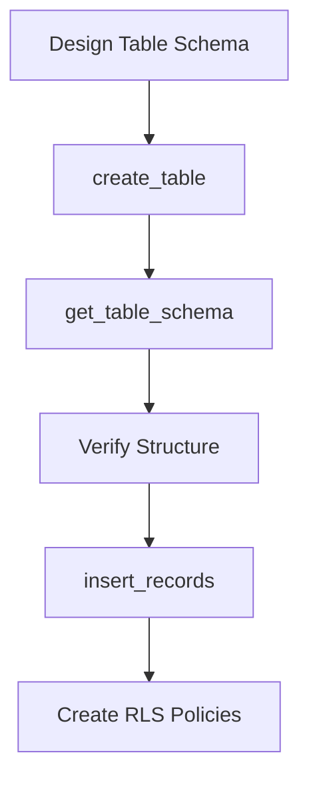
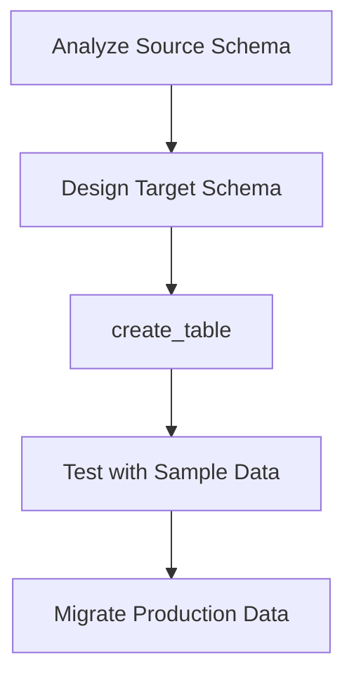

## Overview

The `create_table` tool enables you to create new database tables with full control over column definitions, data types, constraints, and security settings. It supports all PostgreSQL data types and automatically handles primary keys, foreign keys, unique constraints, and Row Level Security (RLS) configuration.

<Warning>
This tool **creates permanent database structures**. Always verify your table design before execution.
</Warning>

## Parameters

| Parameter | Type | Required | Default | Description |
|-----------|------|----------|---------|-------------|
| `table_name` | string | Yes | - | Name for the new table |
| `columns` | array | Yes | - | Array of column definitions |
| `enable_rls` | boolean | No | true | Enable Row Level Security |

### Column Definition Object

| Field | Type | Required | Description |
|-------|------|----------|-------------|
| `name` | string | Yes | Column name |
| `type` | string | Yes | PostgreSQL data type |
| `nullable` | boolean | No | Whether column accepts NULL (default: true) |
| `primary_key` | boolean | No | Whether column is primary key (default: false) |
| `unique` | boolean | No | Whether column has unique constraint (default: false) |
| `default_value` | string | No | Default value for the column |

## Request Format

```json
{
  "table_name": "blog_posts",
  "columns": [
    {
      "name": "id",
      "type": "integer",
      "primary_key": true,
      "nullable": false
    },
    {
      "name": "title",
      "type": "text",
      "nullable": false
    },
    {
      "name": "content",
      "type": "text",
      "nullable": true
    },
    {
      "name": "created_at",
      "type": "timestamp",
      "default_value": "now()",
      "nullable": false
    }
  ],
  "enable_rls": true
}
```

## Response Format

```json
{
  "success": true,
  "data": {
    "table_name": "blog_posts",
    "columns_created": 4,
    "constraints_added": ["PRIMARY KEY", "NOT NULL constraints"],
    "rls_enabled": true,
    "sql_executed": "CREATE TABLE blog_posts (id integer PRIMARY KEY NOT NULL, title text NOT NULL, content text, created_at timestamp DEFAULT now() NOT NULL); ALTER TABLE blog_posts ENABLE ROW LEVEL SECURITY;"
  },
  "message": "Table 'blog_posts' created successfully with 4 columns",
  "execution_time": "245ms"
}
```

## Usage Examples

<CodeGroup>

```json Simple User Table
{
  "table_name": "users",
  "columns": [
    {
      "name": "id",
      "type": "serial",
      "primary_key": true,
      "nullable": false
    },
    {
      "name": "email",
      "type": "varchar(255)",
      "nullable": false,
      "unique": true
    },
    {
      "name": "password_hash",
      "type": "text",
      "nullable": false
    },
    {
      "name": "created_at",
      "type": "timestamp",
      "default_value": "CURRENT_TIMESTAMP",
      "nullable": false
    }
  ],
  "enable_rls": true
}
```

```json Product Catalog Table
{
  "table_name": "products",
  "columns": [
    {
      "name": "id",
      "type": "uuid",
      "primary_key": true,
      "default_value": "gen_random_uuid()",
      "nullable": false
    },
    {
      "name": "name",
      "type": "text",
      "nullable": false
    },
    {
      "name": "description",
      "type": "text"
    },
    {
      "name": "price",
      "type": "decimal(10,2)",
      "nullable": false
    },
    {
      "name": "category_id",
      "type": "integer",
      "nullable": false
    },
    {
      "name": "in_stock",
      "type": "boolean",
      "default_value": "true",
      "nullable": false
    },
    {
      "name": "metadata",
      "type": "jsonb"
    }
  ]
}
```

```json Order Management Table
{
  "table_name": "orders",
  "columns": [
    {
      "name": "id",
      "type": "bigserial",
      "primary_key": true,
      "nullable": false
    },
    {
      "name": "customer_id",
      "type": "uuid",
      "nullable": false
    },
    {
      "name": "status",
      "type": "varchar(50)",
      "default_value": "'pending'",
      "nullable": false
    },
    {
      "name": "total_amount",
      "type": "decimal(12,2)",
      "nullable": false
    },
    {
      "name": "order_date",
      "type": "timestamp with time zone",
      "default_value": "now()",
      "nullable": false
    },
    {
      "name": "shipping_address",
      "type": "jsonb"
    }
  ],
  "enable_rls": true
}
```

```bash Claude Desktop
"Create a table called 'users' with id, email, and created_at columns"
"I need a products table with name, price, and description fields"
"Create an orders table with customer reference and total amount"
```

</CodeGroup>

## Supported Data Types

### Numeric Types
- `integer`, `int`, `int4` - 32-bit integer
- `bigint`, `int8` - 64-bit integer  
- `serial` - Auto-incrementing integer
- `bigserial` - Auto-incrementing big integer
- `decimal(p,s)`, `numeric(p,s)` - Arbitrary precision decimal
- `real`, `float4` - 32-bit floating point
- `double precision`, `float8` - 64-bit floating point

### Text Types
- `text` - Variable-length text
- `varchar(n)`, `character varying(n)` - Variable-length with limit
- `char(n)`, `character(n)` - Fixed-length text

### Date/Time Types
- `timestamp` - Date and time
- `timestamp with time zone`, `timestamptz` - Timestamp with timezone
- `date` - Date only
- `time` - Time only
- `interval` - Time interval

### Other Types
- `boolean`, `bool` - True/false values
- `uuid` - Universally unique identifier
- `jsonb` - Binary JSON data
- `json` - Text JSON data
- `bytea` - Binary data

## Common Table Patterns

### User Authentication Table
```json
{
  "table_name": "users",
  "columns": [
    {"name": "id", "type": "uuid", "primary_key": true, "default_value": "gen_random_uuid()", "nullable": false},
    {"name": "email", "type": "varchar(255)", "unique": true, "nullable": false},
    {"name": "password_hash", "type": "text", "nullable": false},
    {"name": "email_verified", "type": "boolean", "default_value": "false", "nullable": false},
    {"name": "created_at", "type": "timestamptz", "default_value": "now()", "nullable": false},
    {"name": "updated_at", "type": "timestamptz", "default_value": "now()", "nullable": false}
  ],
  "enable_rls": true
}
```

### Audit Log Table
```json
{
  "table_name": "audit_logs",
  "columns": [
    {"name": "id", "type": "bigserial", "primary_key": true, "nullable": false},
    {"name": "user_id", "type": "uuid", "nullable": false},
    {"name": "action", "type": "varchar(100)", "nullable": false},
    {"name": "table_name", "type": "varchar(100)", "nullable": false},
    {"name": "record_id", "type": "text", "nullable": false},
    {"name": "old_values", "type": "jsonb"},
    {"name": "new_values", "type": "jsonb"},
    {"name": "timestamp", "type": "timestamptz", "default_value": "now()", "nullable": false}
  ],
  "enable_rls": true
}
```

### File Storage Table
```json
{
  "table_name": "files",
  "columns": [
    {"name": "id", "type": "uuid", "primary_key": true, "default_value": "gen_random_uuid()", "nullable": false},
    {"name": "filename", "type": "text", "nullable": false},
    {"name": "content_type", "type": "varchar(255)", "nullable": false},
    {"name": "file_size", "type": "bigint", "nullable": false},
    {"name": "storage_path", "type": "text", "nullable": false},
    {"name": "owner_id", "type": "uuid", "nullable": false},
    {"name": "is_public", "type": "boolean", "default_value": "false", "nullable": false},
    {"name": "uploaded_at", "type": "timestamptz", "default_value": "now()", "nullable": false}
  ],
  "enable_rls": true
}
```

## Integration with Other Tools

<CardGroup cols={2}>
  <Card title="list_tables" icon="table">
    Verify table creation and check for naming conflicts
  </Card>
  <Card title="get_table_schema" icon="sitemap">
    Confirm table structure after creation
  </Card>
  <Card title="alter_table" icon="wrench">
    Modify table structure after creation
  </Card>
  <Card title="insert_records" icon="arrow-up">
    Add initial data to newly created tables
  </Card>
</CardGroup>

## Error Handling

### Table Already Exists
```json
{
  "success": false,
  "error": {
    "type": "ValidationError",
    "message": "Table 'users' already exists",
    "suggestions": [
      "Choose a different table name",
      "Use alter_table to modify existing table",
      "Drop existing table first if replacement intended"
    ]
  }
}
```

### Invalid Data Type
```json
{
  "success": false,
  "error": {
    "type": "ValidationError",
    "message": "Invalid data type 'varchar' for column 'email'",
    "suggestions": [
      "Use 'varchar(n)' with length specification",
      "Consider using 'text' for variable-length strings",
      "Check PostgreSQL data type documentation"
    ]
  }
}
```

### Missing Primary Key
```json
{
  "success": false,
  "error": {
    "type": "ValidationError",
    "message": "Table must have at least one primary key column",
    "suggestions": [
      "Add a column with 'primary_key': true",
      "Consider using 'serial' or 'uuid' for primary keys",
      "Use composite primary key if needed"
    ]
  }
}
```

### Permission Issues
```json
{
  "success": false,
  "error": {
    "type": "PermissionError",
    "message": "Insufficient permissions to create table",
    "suggestions": [
      "Verify service role has table creation privileges",
      "Check database user permissions",
      "Contact database administrator"
    ]
  }
}
```

## Best Practices

### 1. Primary Key Design
Always include a proper primary key:

```json
// Good: Serial integer key
{"name": "id", "type": "serial", "primary_key": true, "nullable": false}

// Good: UUID key
{"name": "id", "type": "uuid", "primary_key": true, "default_value": "gen_random_uuid()", "nullable": false}

// Avoid: No primary key (will cause issues)
```

### 2. Timestamp Columns
Include created/updated timestamps:

```json
{
  "name": "created_at",
  "type": "timestamptz",
  "default_value": "now()",
  "nullable": false
},
{
  "name": "updated_at", 
  "type": "timestamptz",
  "default_value": "now()",
  "nullable": false
}
```

### 3. Nullable vs Non-Nullable
Be explicit about null handling:

```json
// Required fields
{"name": "email", "type": "varchar(255)", "nullable": false}

// Optional fields  
{"name": "phone", "type": "varchar(20)", "nullable": true}
```

### 4. Default Values
Use appropriate defaults:

```json
// Timestamps
{"name": "created_at", "type": "timestamptz", "default_value": "now()"}

// Booleans
{"name": "is_active", "type": "boolean", "default_value": "true"}

// Status fields
{"name": "status", "type": "varchar(20)", "default_value": "'pending'"}
```

### 5. Security Considerations
Enable RLS for sensitive tables:

```json
{
  "table_name": "user_profiles",
  "enable_rls": true,  // Enable by default
  "columns": [...] 
}
```

## Workflow Examples

### Complete Table Setup


### Migration Workflow


## Performance Considerations

- **Creation Time**: 200ms - 1s depending on complexity
- **Column Count**: More columns increase creation time
- **Constraints**: Primary keys and unique constraints add overhead
- **RLS**: Enabling RLS adds minimal overhead to creation

<Tip>
Create tables during low-traffic periods for production databases, as table creation can briefly lock system catalogs.
</Tip>

## Security Notes

- **RLS Enabled**: By default, Row Level Security is enabled for new tables
- **Permissions**: Respects database user permissions for table creation
- **Input Validation**: All column definitions are validated before execution
- **SQL Injection**: Uses parameterized queries to prevent injection attacks

## Troubleshooting

### Creation Fails
Common issues and solutions:

1. **Name Conflicts**: Table name already exists
2. **Invalid Types**: Check PostgreSQL type syntax
3. **Permission Issues**: Verify service role privileges
4. **Reserved Words**: Avoid SQL reserved words as table/column names

### Performance Issues
If table creation is slow:

1. **Complex Constraints**: Many constraints slow creation
2. **Large Defaults**: Complex default value functions
3. **System Load**: Database server under heavy load

## Related Tools

<CardGroup cols={3}>
  <Card title="list_tables" icon="table" href="/mcp/tools/list-tables">
    Verify table creation success
  </Card>
  <Card title="alter_table" icon="wrench" href="/mcp/tools/alter-table">
    Modify table structure after creation
  </Card>
  <Card title="drop_table" icon="trash" href="/mcp/tools/drop-table">
    Remove tables if needed
  </Card>
</CardGroup>