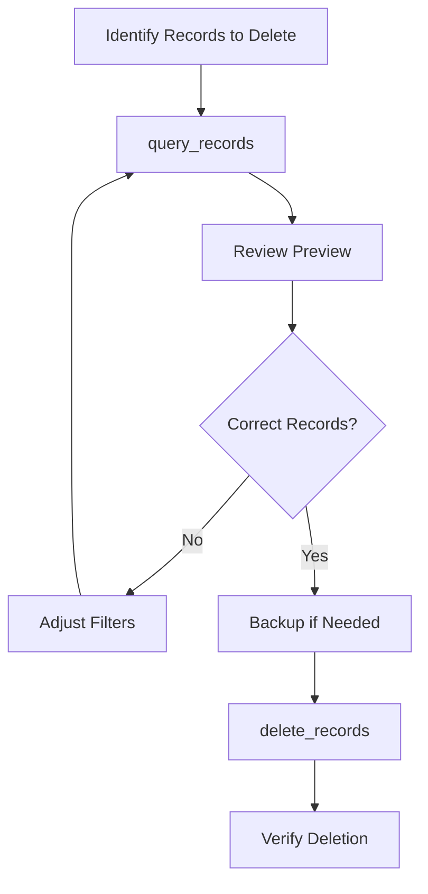
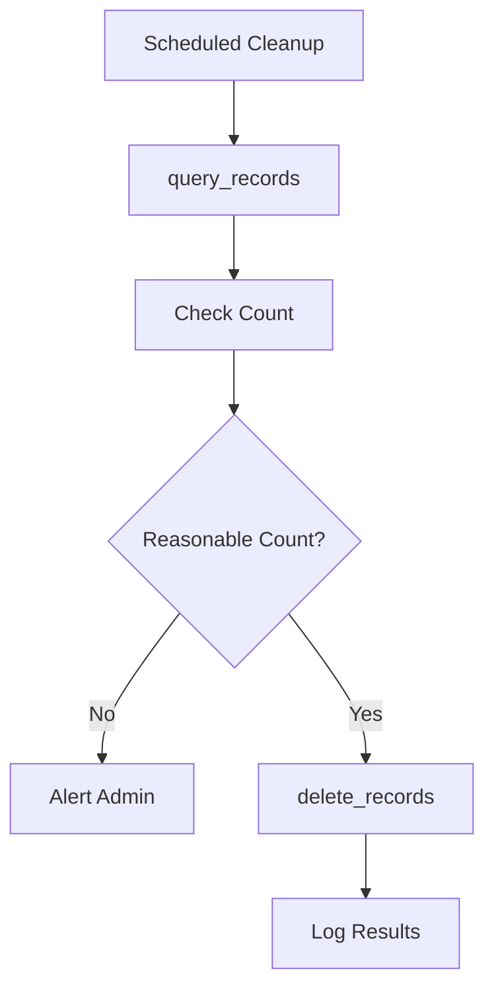

## Overview

The `delete_records` tool enables you to safely remove records from your database tables. This **destructive operation** includes mandatory confirmation requirements, safety limits, and comprehensive filtering to prevent accidental data loss. The tool provides detailed feedback on deletion operations and supports both single and batch deletions.

<Warning>
This tool **permanently deletes data** from your database. Deleted records **cannot be recovered** without database backups. Always verify your filters and use confirmation parameters.
</Warning>

## Parameters

| Parameter | Type | Required | Description |
|-----------|------|----------|-------------|
| `table_name` | string | Yes | Target table for deletions |
| `filters` | object | Yes | Conditions to match records for deletion |
| `confirm` | boolean | Yes | Must be `true` to confirm deletion |
| `limit` | number | No | Maximum number of records to delete |
| `return_records` | boolean | No | Whether to return deleted records (default: true) |

### Safety Requirements

<Warning>
Both `filters` and `confirm` are **mandatory** to prevent accidental deletion of all table data. These safety mechanisms ensure you explicitly target specific records and acknowledge the destructive nature of the operation.
</Warning>

## Request Format

```json
{
  "table_name": "user_sessions",
  "filters": {
    "expires_at": {"lt": "2023-12-01T00:00:00Z"}
  },
  "confirm": true,
  "limit": 100,
  "return_records": true
}
```

## Response Format

```json
{
  "success": true,
  "data": {
    "deleted_count": 15,
    "records": [
      {
        "id": 1001,
        "user_id": 123,
        "expires_at": "2023-11-30T10:30:00Z",
        "created_at": "2023-11-30T08:00:00Z"
      },
      // ... more deleted records
    ],
    "filters_applied": {
      "expires_at": {"lt": "2023-12-01T00:00:00Z"}
    },
    "limit_applied": 100,
    "has_more": false
  },
  "message": "Successfully deleted 15 records from 'user_sessions'",
  "execution_time": "89ms"
}
```

## Usage Examples

<CodeGroup>

```json Single Record Deletion
{
  "table_name": "users",
  "filters": {
    "id": {"eq": 123}
  },
  "confirm": true
}
```

```json Expired Records Cleanup
{
  "table_name": "user_sessions",
  "filters": {
    "expires_at": {"lt": "2023-12-01T00:00:00Z"}
  },
  "confirm": true,
  "limit": 1000,
  "return_records": false
}
```

```json Soft Delete Cleanup
{
  "table_name": "posts",
  "filters": {
    "deleted_at": {"not_null": true},
    "deleted_at": {"lt": "2023-11-01T00:00:00Z"}
  },
  "confirm": true,
  "limit": 500
}
```

```json Test Data Cleanup
{
  "table_name": "test_users",
  "filters": {
    "email": {"like": "%@test.example.com"}
  },
  "confirm": true,
  "return_records": false
}
```

```json Conditional Deletion
{
  "table_name": "temporary_uploads",
  "filters": {
    "created_at": {"lt": "2023-11-24T00:00:00Z"},
    "status": {"eq": "temporary"}
  },
  "confirm": true,
  "limit": 200
}
```

```bash Claude Desktop
"Delete the user with id 123 - I confirm this action"
"Remove all expired sessions older than 7 days"
"Clean up test data with @test.example.com emails"
```

</CodeGroup>

## Filter Examples

### Time-Based Cleanup
```json
{
  "filters": {
    "created_at": {"lt": "2023-11-01T00:00:00Z"},
    "status": {"eq": "temporary"}
  }
}
```

### Status-Based Deletion
```json
{
  "filters": {
    "status": {"in": ["deleted", "banned", "suspended"]},
    "updated_at": {"lt": "2023-10-01T00:00:00Z"}
  }
}
```

### User-Specific Deletion
```json
{
  "filters": {
    "user_id": {"eq": 12345},
    "type": {"eq": "draft"}
  }
}
```

### Pattern-Based Deletion
```json
{
  "filters": {
    "email": {"like": "%@temp.example.com"},
    "verified": {"eq": false}
  }
}
```

### Null-Based Cleanup
```json
{
  "filters": {
    "deleted_at": {"not_null": true},
    "permanent_delete_at": {"lt": "2023-12-01T00:00:00Z"}
  }
}
```

## Safety Mechanisms

### Mandatory Confirmation
The `confirm` parameter prevents accidental deletions:

```json
// This will FAIL - confirmation required
{
  "table_name": "users",
  "filters": {"status": {"eq": "inactive"}}
}

// This will FAIL - explicit confirmation required
{
  "table_name": "users",
  "filters": {"status": {"eq": "inactive"}},
  "confirm": false
}

// This will SUCCEED - proper confirmation
{
  "table_name": "users",
  "filters": {"status": {"eq": "inactive"}},
  "confirm": true
}
```

### Mandatory Filters
All delete operations require filters to prevent accidental bulk deletions:

```json
// This will FAIL - no filters provided
{
  "table_name": "logs",
  "confirm": true
}

// This will SUCCEED - specific filters provided
{
  "table_name": "logs",
  "filters": {"created_at": {"lt": "2023-11-01"}},
  "confirm": true
}
```

### Limit Protection
Use limits to prevent accidental mass deletions:

```json
{
  "table_name": "user_activity",
  "filters": {"created_at": {"lt": "2023-06-01"}},
  "confirm": true,
  "limit": 1000  // Safety limit
}
```

## Error Handling

### Missing Confirmation
```json
{
  "success": false,
  "error": {
    "type": "SafetyError",
    "message": "Record deletion requires explicit confirmation",
    "suggestions": [
      "Set 'confirm': true to proceed with deletion",
      "This safety check prevents accidental data loss",
      "Ensure you have backed up important data"
    ]
  }
}
```

### Missing Filters
```json
{
  "success": false,
  "error": {
    "type": "SafetyError",
    "message": "Filters are required for delete operations",
    "suggestions": [
      "Provide filters to target specific records",
      "This prevents accidental deletion of all records",
      "Use appropriate filter conditions"
    ]
  }
}
```

### No Records Found
```json
{
  "success": true,
  "data": {
    "deleted_count": 0,
    "records": [],
    "message": "No records matched the specified filters"
  },
  "message": "No records were deleted",
  "execution_time": "23ms"
}
```

### Foreign Key Constraint
```json
{
  "success": false,
  "error": {
    "type": "ConstraintError",
    "message": "Cannot delete record: foreign key constraint exists",
    "details": "Record is referenced by other tables",
    "suggestions": [
      "Delete dependent records first",
      "Update foreign key references",
      "Use cascade delete if appropriate"
    ]
  }
}
```

### Permission Issues
```json
{
  "success": false,
  "error": {
    "type": "PermissionError",
    "message": "Insufficient permissions to delete from table",
    "suggestions": [
      "Verify service role has delete privileges",
      "Check Row Level Security policies",
      "Contact database administrator"
    ]
  }
}
```

## Common Deletion Patterns

### Cleanup Operations

#### Expired Sessions
```json
{
  "table_name": "user_sessions",
  "filters": {
    "expires_at": {"lt": "2023-12-01T00:00:00Z"}
  },
  "confirm": true,
  "limit": 5000,
  "return_records": false
}
```

#### Old Log Entries
```json
{
  "table_name": "application_logs",
  "filters": {
    "created_at": {"lt": "2023-11-01T00:00:00Z"},
    "level": {"in": ["debug", "info"]}
  },
  "confirm": true,
  "limit": 10000,
  "return_records": false
}
```

#### Temporary Files
```json
{
  "table_name": "temp_uploads",
  "filters": {
    "status": {"eq": "temporary"},
    "created_at": {"lt": "2023-11-30T00:00:00Z"}
  },
  "confirm": true,
  "return_records": false
}
```

### Data Management

#### User Account Deletion
```json
{
  "table_name": "user_accounts",
  "filters": {
    "id": {"eq": 12345},
    "status": {"eq": "marked_for_deletion"}
  },
  "confirm": true,
  "limit": 1
}
```

#### Duplicate Removal
```json
{
  "table_name": "email_subscriptions",
  "filters": {
    "email": {"eq": "duplicate@example.com"},
    "created_at": {"lt": "2023-11-01T00:00:00Z"}
  },
  "confirm": true,
  "limit": 10
}
```

#### Test Data Cleanup
```json
{
  "table_name": "test_orders",
  "filters": {
    "customer_email": {"like": "%@test.example.com"}
  },
  "confirm": true,
  "return_records": false
}
```

## Integration with Other Tools

<CardGroup cols={2}>
  <Card title="query_records" icon="magnifying-glass">
    Preview records before deletion and verify results
  </Card>
  <Card title="get_table_schema" icon="sitemap">
    Check foreign key constraints before deletion
  </Card>
  <Card title="update_records" icon="pen-to-square">
    Soft delete records instead of permanent deletion
  </Card>
  <Card title="insert_records" icon="arrow-up">
    Archive records before deletion
  </Card>
</CardGroup>

## Best Practices

### 1. Always Preview Before Deleting
Check what records will be affected before deletion:

```bash
# Recommended workflow
1. query_records         # Preview records to be deleted
2. Verify target records # Ensure correct records selected
3. delete_records        # Execute deletion with confirmation
4. query_records         # Verify deletion completed
```

### 2. Use Appropriate Limits
Set reasonable limits to prevent accidental mass deletions:

```json
{
  "filters": {"status": {"eq": "inactive"}},
  "confirm": true,
  "limit": 100  // Process in batches
}
```

### 3. Consider Soft Deletes First
Use soft deletion for recoverable operations:

```json
// Instead of permanent deletion
{
  "table_name": "users",
  "filters": {"id": {"eq": 123}},
  "updates": {
    "deleted_at": "2023-12-01T10:30:00Z",
    "status": "deleted"
  }
}
```

### 4. Archive Important Data
Backup critical data before deletion:

```bash
# Good practice
1. query_records         # Export data to backup
2. Save backup           # Store in secure location
3. delete_records        # Proceed with deletion
```

### 5. Handle Dependencies
Check for foreign key relationships:

```bash
# Safe deletion process
1. get_table_schema      # Check foreign key constraints
2. Handle dependencies   # Delete/update dependent records
3. delete_records        # Delete target records
```

## Performance Considerations

### Batch Processing
For large deletions, use batched operations:

```json
{
  "filters": {"created_at": {"lt": "2023-01-01"}},
  "confirm": true,
  "limit": 1000,          // Process in batches
  "return_records": false  // Improve performance
}
```

### Index Usage
Delete operations perform better with indexed filter columns:

```json
// Good: Filter on indexed column
{
  "filters": {"id": {"eq": 123}},  // Primary key (indexed)
  "confirm": true
}

// Less efficient: Filter on non-indexed column
{
  "filters": {"description": {"like": "%text%"}},  // Text search
  "confirm": true
}
```

## Safety Workflows

### Careful Deletion Process


### Cleanup Automation


## Recovery Considerations

### No Built-in Recovery
Once records are deleted, recovery options are limited:

1. **Database Backups**: Restore from full database backup
2. **Point-in-time Recovery**: Use PostgreSQL PITR if available  
3. **Application Backups**: Restore from application-level exports
4. **Audit Logs**: Recreate from audit trail if available

### Prevention Strategies
Prevent accidental data loss:

1. **Soft Deletes**: Mark records as deleted instead of removing
2. **Archival**: Move data to archive tables before deletion
3. **Confirmation**: Always require explicit confirmation
4. **Limits**: Use reasonable batch sizes
5. **Testing**: Test deletion logic in non-production environments

## Troubleshooting

### No Records Deleted
If `deleted_count` is 0:

1. **Check Filters**: Verify filter conditions match existing data
2. **Data Exists**: Use `query_records` to confirm records exist
3. **Filter Syntax**: Ensure filter operators are correct
4. **Permissions**: Verify service role can delete from table

### Constraint Violations
If deletions fail due to foreign keys:

1. **Check Dependencies**: Identify tables with foreign key references
2. **Delete Order**: Remove dependent records first
3. **Update References**: Set foreign keys to null or other values
4. **Cascade**: Consider using CASCADE DELETE constraints

### Performance Issues
If deletions are slow:

1. **Add Indexes**: Ensure filter columns are indexed
2. **Reduce Batch Size**: Use smaller limits
3. **Optimize Filters**: Use more selective conditions
4. **Disable Returns**: Set `return_records: false`

## Related Tools

<CardGroup cols={3}>
  <Card title="query_records" icon="magnifying-glass" href="/mcp/tools/query-records">
    Preview records before deletion and verify results
  </Card>
  <Card title="update_records" icon="pen-to-square" href="/mcp/tools/update-records">
    Implement soft deletion patterns
  </Card>
  <Card title="get_table_schema" icon="sitemap" href="/mcp/tools/get-table-schema">
    Check constraints before deletion
  </Card>
</CardGroup>