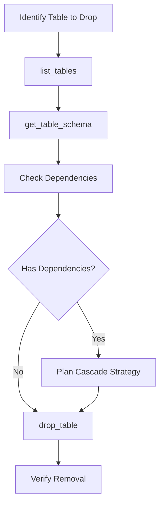
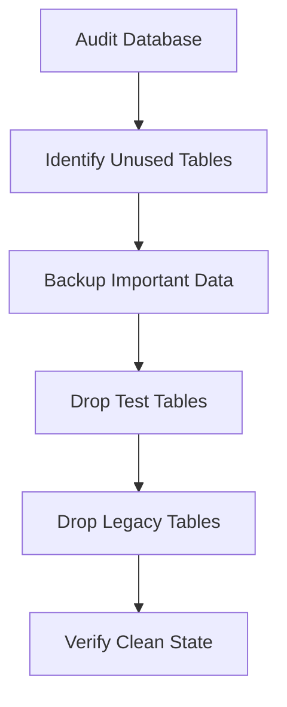

## Overview

The `drop_table` tool safely removes database tables from your Supabase database. This is a **destructive operation** that permanently deletes the table and all its data. The tool includes mandatory confirmation parameters and cascade options to handle dependent objects properly.

<Warning>
This operation **permanently deletes** the table and all its data. This action **cannot be undone**. Always backup important data before dropping tables.
</Warning>

## Parameters

| Parameter | Type | Required | Default | Description |
|-----------|------|----------|---------|-------------|
| `table_name` | string | Yes | - | Name of the table to drop |
| `confirm` | boolean | Yes | - | Must be `true` to confirm deletion |
| `cascade` | boolean | No | false | Drop dependent objects (views, foreign keys, etc.) |

### Parameter Details

- **`table_name`**: Must be an existing table name (case-sensitive)
- **`confirm`**: Safety mechanism - must explicitly be set to `true`
- **`cascade`**: When `true`, automatically drops dependent objects like foreign key constraints and views

## Request Format

```json
{
  "table_name": "old_table",
  "confirm": true,
  "cascade": false
}
```

## Response Format

```json
{
  "success": true,
  "data": {
    "table_name": "old_table",
    "table_dropped": true,
    "cascade_used": false,
    "dependent_objects_dropped": [],
    "sql_executed": "DROP TABLE old_table;"
  },
  "message": "Table 'old_table' dropped successfully",
  "execution_time": "89ms"
}
```

## Usage Examples

<CodeGroup>

```json Simple Table Drop
{
  "table_name": "temporary_data",
  "confirm": true
}
```

```json Drop with Cascade
{
  "table_name": "categories", 
  "confirm": true,
  "cascade": true
}
```

```json Development Cleanup
{
  "table_name": "test_users",
  "confirm": true,
  "cascade": false
}
```

```bash Claude Desktop
"Drop the temporary_data table - I confirm this action"
"Remove the old_logs table and all its dependencies"
"Delete the test_table - yes I'm sure"
```

```bash MCP Inspector
1. Select "drop_table" from available tools
2. Enter table_name: "unwanted_table"
3. Set confirm: true
4. Set cascade: true (if needed)
5. Click "Execute"
```

</CodeGroup>

## Cascade Behavior

### Without Cascade (Default)
When `cascade: false`, the operation will fail if dependent objects exist:

```json
{
  "success": false,
  "error": {
    "type": "DependencyError",
    "message": "Cannot drop table 'users': foreign key constraint exists",
    "suggestions": [
      "Use cascade: true to drop dependent objects",
      "Manually drop foreign key constraints first",
      "Check which objects depend on this table"
    ]
  }
}
```

### With Cascade
When `cascade: true`, dependent objects are automatically dropped:

```json
{
  "success": true,
  "data": {
    "table_name": "categories",
    "cascade_used": true,
    "dependent_objects_dropped": [
      "Foreign key: products.category_id -> categories.id",
      "View: category_summary",
      "Index: categories_name_idx"
    ]
  }
}
```

## Common Use Cases

### Development Cleanup
Remove temporary or test tables during development:

```json
{
  "table_name": "test_data_migration",
  "confirm": true,
  "cascade": false
}
```

### Schema Refactoring
Remove obsolete tables during database restructuring:

```json
{
  "table_name": "legacy_user_sessions",
  "confirm": true,
  "cascade": true
}
```

### Prototype Cleanup
Clean up experimental tables:

```json
{
  "table_name": "experimental_features",
  "confirm": true,
  "cascade": false
}
```

## Safety Mechanisms

### Mandatory Confirmation
The `confirm` parameter prevents accidental deletions:

```json
// This will FAIL - confirmation required
{
  "table_name": "important_data"
}

// This will FAIL - explicit confirmation required  
{
  "table_name": "important_data",
  "confirm": false
}

// This will SUCCEED - proper confirmation
{
  "table_name": "important_data", 
  "confirm": true
}
```

### Dependency Checking
Without cascade, dependent objects prevent deletion:

```json
// Will fail if foreign keys reference this table
{
  "table_name": "users",
  "confirm": true,
  "cascade": false
}

// Will succeed and remove all dependencies
{
  "table_name": "users",
  "confirm": true, 
  "cascade": true
}
```

## Error Handling

### Table Not Found
```json
{
  "success": false,
  "error": {
    "type": "ValidationError",
    "message": "Table 'nonexistent_table' not found",
    "suggestions": [
      "Check table name spelling (case-sensitive)",
      "Use list_tables to see available tables",
      "Verify table exists in correct schema"
    ]
  }
}
```

### Missing Confirmation
```json
{
  "success": false,
  "error": {
    "type": "SafetyError",
    "message": "Table deletion requires explicit confirmation",
    "suggestions": [
      "Set 'confirm': true to proceed with deletion",
      "This safety check prevents accidental data loss",
      "Ensure you have backed up important data"
    ]
  }
}
```

### Dependency Conflicts
```json
{
  "success": false,
  "error": {
    "type": "DependencyError", 
    "message": "Cannot drop table 'categories': dependent objects exist",
    "dependent_objects": [
      "Foreign key constraint: products.category_id",
      "View: active_categories"
    ],
    "suggestions": [
      "Use 'cascade': true to drop dependent objects",
      "Manually remove dependencies first",
      "Consider altering dependent tables instead"
    ]
  }
}
```

### Permission Issues
```json
{
  "success": false,
  "error": {
    "type": "PermissionError",
    "message": "Insufficient permissions to drop table",
    "suggestions": [
      "Verify service role has table drop privileges",
      "Check database user permissions", 
      "Contact database administrator"
    ]
  }
}
```

## Integration with Other Tools

<CardGroup cols={2}>
  <Card title="list_tables" icon="table">
    Verify table exists before attempting to drop it
  </Card>
  <Card title="get_table_schema" icon="sitemap">
    Check table structure and dependencies before dropping
  </Card>
  <Card title="query_records" icon="magnifying-glass">
    Backup important data before table deletion
  </Card>
  <Card title="create_table" icon="plus">
    Recreate tables with improved structure after dropping
  </Card>
</CardGroup>

## Best Practices

### 1. Always Backup First
Before dropping any table with important data:

```bash
# Good workflow
1. query_records         # Export important data
2. Document schema       # Save table structure
3. drop_table           # Remove table
4. Verify cleanup       # Confirm deletion
```

### 2. Check Dependencies
Understand what will be affected:

```bash
# Recommended process
1. get_table_schema      # Check for foreign keys
2. List dependent views  # Identify connected objects
3. Plan cascade strategy # Decide on cascade usage
4. drop_table           # Execute with appropriate settings
```

### 3. Use Descriptive Confirmation
Be explicit about what you're dropping:

```bash
# In production, be extra careful
- Double-check table name
- Verify this is correct environment  
- Confirm backup exists
- Use cascade appropriately
```

### 4. Development vs Production
Use different approaches based on environment:

```json
// Development: Quick cleanup
{
  "table_name": "temp_table",
  "confirm": true,
  "cascade": true
}

// Production: Careful removal
{
  "table_name": "legacy_data",
  "confirm": true,
  "cascade": false  // Handle dependencies manually
}
```

## Workflow Examples

### Safe Table Removal


### Database Cleanup


## Recovery Considerations

### No Built-in Recovery
Once a table is dropped, recovery options are limited:

1. **Database Backups**: Restore from full database backup
2. **Point-in-time Recovery**: Use PostgreSQL PITR if available
3. **Application Backups**: Restore from application-level data exports
4. **Replication**: Restore from read replicas if they exist

### Prevention Strategies
Prevent accidental data loss:

1. **Regular Backups**: Automated database backups
2. **Staging Environment**: Test drops in non-production first
3. **Data Exports**: Export critical data before dropping
4. **Version Control**: Track schema changes in code

## Performance Considerations

- **Drop Time**: Usually < 100ms for small tables, longer for large tables
- **Dependencies**: Tables with many dependencies take longer to process
- **Cascade Operations**: Can be slow if many objects depend on the table
- **Locking**: Brief exclusive lock during drop operation

<Tip>
Dropping large tables during low-traffic periods minimizes impact on other database operations.
</Tip>

## Security Notes

- **Irreversible**: Table drops cannot be undone without backups
- **Cascade Impact**: Cascade operations can affect multiple database objects
- **Permission Required**: Requires appropriate database privileges
- **Audit Trail**: All drop operations should be logged for compliance

## Troubleshooting

### Permission Denied
If you can't drop a table:

1. **Check Privileges**: Verify DROP TABLE permission
2. **Service Role**: Ensure using correct service role key
3. **Table Owner**: May need to be table owner or superuser
4. **System Tables**: Cannot drop PostgreSQL system tables

### Cascade Issues
If cascade operations fail:

1. **Complex Dependencies**: Some dependencies cannot be auto-dropped
2. **Circular References**: May need manual intervention
3. **System Objects**: Some system-level dependencies are protected
4. **Permission Chain**: May lack permissions on dependent objects

## Related Tools

<CardGroup cols={3}>
  <Card title="list_tables" icon="table" href="/mcp/tools/list-tables">
    List tables before deciding which to drop
  </Card>
  <Card title="alter_table" icon="wrench" href="/mcp/tools/alter-table">
    Modify tables instead of dropping them
  </Card>
  <Card title="create_table" icon="plus" href="/mcp/tools/create-table">
    Create replacement tables with better design
  </Card>
</CardGroup>