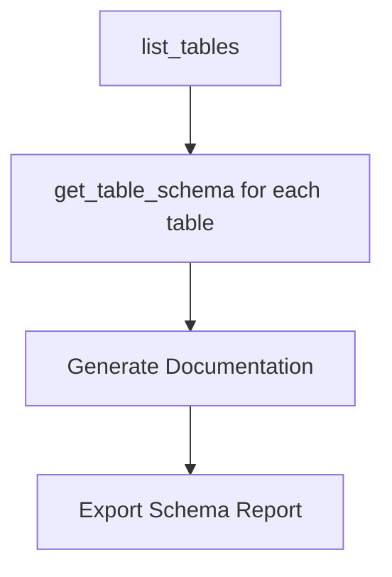
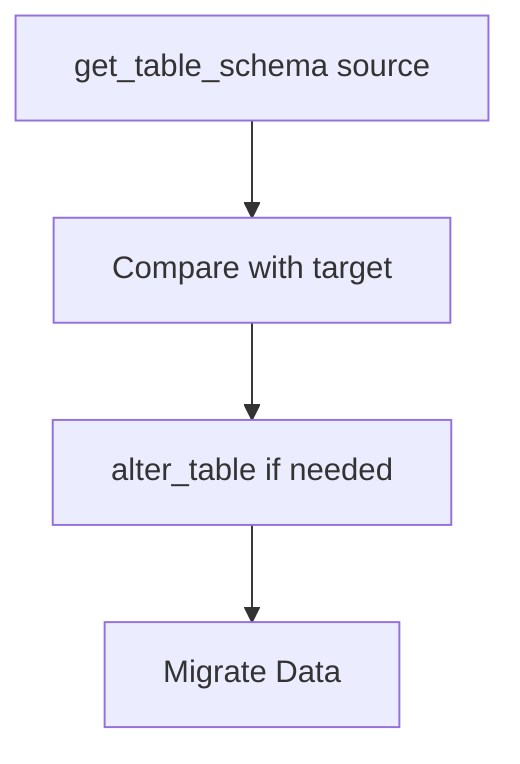

## Overview

The `get_table_schema` tool provides comprehensive schema information for a specific table, including column definitions, data types, constraints, primary keys, foreign keys, and other metadata. This tool is essential for understanding table structure before performing data operations.

<Note>
This is a **safe operation** that only reads schema metadata and never modifies your database.
</Note>

## Parameters

| Parameter | Type | Required | Description |
|-----------|------|----------|-------------|
| `table_name` | string | Yes | Name of the table to inspect |

### Parameter Details

- **`table_name`**: Must be an existing table name (case-sensitive)

## Request Format

```json
{
  "table_name": "users"
}
```

## Response Format

The tool returns detailed schema information with comprehensive column metadata:

```json
{
  "success": true,
  "data": {
    "table_name": "users",
    "schema": "public",
    "columns": [
      {
        "name": "id",
        "type": "integer",
        "nullable": false,
        "primary_key": true,
        "auto_increment": true,
        "default_value": null
      },
      {
        "name": "email",
        "type": "character varying",
        "nullable": false,
        "unique": true,
        "max_length": 255,
        "default_value": null
      },
      {
        "name": "created_at",
        "type": "timestamp with time zone",
        "nullable": false,
        "default_value": "now()"
      },
      {
        "name": "profile_id",
        "type": "integer",
        "nullable": true,
        "foreign_key": {
          "references_table": "profiles",
          "references_column": "id"
        }
      }
    ],
    "constraints": [
      {
        "name": "users_pkey",
        "type": "PRIMARY KEY",
        "columns": ["id"]
      },
      {
        "name": "users_email_unique",
        "type": "UNIQUE",
        "columns": ["email"]
      }
    ],
    "indexes": [
      {
        "name": "users_email_idx",
        "columns": ["email"],
        "unique": true
      }
    ]
  },
  "message": "Retrieved schema for table 'users'",
  "execution_time": "67ms"
}
```

## Usage Examples

<CodeGroup>

```json Basic Table Schema
{
  "table_name": "users"
}
```

```json Complex Table with Relations
{
  "table_name": "order_items"
}
```

```bash Claude Desktop
"Show me the schema for the users table"
"What columns does the products table have?"
"Get the structure of the orders table"
```

```bash MCP Inspector
1. Select "get_table_schema" from available tools
2. Enter table name: "users"
3. Click "Execute"
4. Review detailed schema information
```

</CodeGroup>

## Response Fields

### Column Information

| Field | Type | Description |
|-------|------|-------------|
| `name` | string | Column name |
| `type` | string | PostgreSQL data type |
| `nullable` | boolean | Whether column accepts NULL values |
| `primary_key` | boolean | Whether column is part of primary key |
| `unique` | boolean | Whether column has unique constraint |
| `auto_increment` | boolean | Whether column auto-increments |
| `default_value` | string/null | Default value for the column |
| `max_length` | number | Maximum length (for character types) |
| `foreign_key` | object | Foreign key relationship information |

### Constraint Information

| Field | Type | Description |
|-------|------|-------------|
| `name` | string | Constraint name |
| `type` | string | Constraint type (PRIMARY KEY, UNIQUE, FOREIGN KEY, etc.) |
| `columns` | array | Columns involved in the constraint |

### Index Information

| Field | Type | Description |
|-------|------|-------------|
| `name` | string | Index name |
| `columns` | array | Columns included in the index |
| `unique` | boolean | Whether index enforces uniqueness |

## Common Use Cases

### Before Data Operations
Always check schema before inserting or updating data:

```json
Request: {"table_name": "products"}
Response: {
  "success": true,
  "data": {
    "table_name": "products",
    "columns": [
      {"name": "id", "type": "integer", "primary_key": true},
      {"name": "name", "type": "text", "nullable": false},
      {"name": "price", "type": "numeric", "nullable": false}
    ]
  }
}
```

### Understanding Relationships
Discover foreign key relationships between tables:

```json
Request: {"table_name": "orders"}
Response: {
  "data": {
    "columns": [
      {
        "name": "customer_id",
        "type": "integer",
        "foreign_key": {
          "references_table": "customers",
          "references_column": "id"
        }
      }
    ]
  }
}
```

### Data Validation
Use schema information to validate data before insertion:

```json
Request: {"table_name": "users"}
Response: {
  "data": {
    "columns": [
      {"name": "email", "type": "character varying", "max_length": 255, "nullable": false}
    ]
  }
}
```

## Integration with Other Tools

<CardGroup cols={2}>
  <Card title="list_tables" icon="table">
    Use to discover table names before getting their schemas
  </Card>
  <Card title="query_records" icon="magnifying-glass">
    Use schema info to construct proper queries with correct column names
  </Card>
  <Card title="insert_records" icon="arrow-up">
    Validate data types and required fields before insertion
  </Card>
  <Card title="create_table" icon="plus">
    Compare schemas when designing new tables
  </Card>
</CardGroup>

## Workflow Examples

### Database Documentation Workflow


### Data Migration Workflow


## Error Handling

### Table Not Found
```json
{
  "success": false,
  "error": {
    "type": "ValidationError",
    "message": "Table 'unknown_table' not found",
    "suggestions": [
      "Check table name spelling (case-sensitive)",
      "Use list_tables to see available tables",
      "Verify table exists in 'public' schema"
    ]
  }
}
```

### Permission Issues
```json
{
  "success": false,
  "error": {
    "type": "PermissionError",
    "message": "Insufficient permissions to access table schema",
    "suggestions": [
      "Verify service role has table access",
      "Check Row Level Security policies",
      "Contact database administrator"
    ]
  }
}
```

### Invalid Parameters
```json
{
  "success": false,
  "error": {
    "type": "ValidationError",
    "message": "Missing required parameter: table_name",
    "suggestions": [
      "Provide table_name parameter",
      "Ensure table_name is a string",
      "Use list_tables to find available tables"
    ]
  }
}
```

## Data Type Reference

### Common PostgreSQL Types

| Type | Description | Example |
|------|-------------|---------|
| `integer` | 32-bit integer | 42 |
| `bigint` | 64-bit integer | 9223372036854775807 |
| `text` | Variable-length text | "Hello World" |
| `character varying(n)` | Variable-length string with limit | varchar(255) |
| `boolean` | True/false values | true |
| `timestamp` | Date and time | "2023-12-01 15:30:00" |
| `numeric` | Arbitrary precision decimal | 123.45 |
| `uuid` | Universally unique identifier | "550e8400-e29b-41d4-a716-446655440000" |
| `jsonb` | Binary JSON data | {"key": "value"} |

## Performance Considerations

- **Response Time**: Typically 50-200ms depending on table complexity
- **Schema Complexity**: More columns and constraints increase response time
- **Caching**: Schema information can be cached safely for moderate periods

<Tip>
Schema information changes infrequently, so it's safe to cache results for several minutes to improve performance.
</Tip>

## Security Notes

- Only returns schema for tables your service role can access
- Respects database-level permissions and RLS policies
- Never exposes actual data, only structure metadata
- Foreign key information shows relationships but not related data

## Best Practices

### 1. Always Check Schema First
Before any data operation, understand the table structure:

```bash
# Good workflow
1. get_table_schema      # Understand structure
2. insert_records        # Insert with correct types
3. query_records         # Query with proper column names
```

### 2. Use for Validation
Validate data against schema constraints:

```javascript
const schema = await getTableSchema("users");
const emailColumn = schema.data.columns.find(col => col.name === "email");
if (emailColumn.max_length && email.length > emailColumn.max_length) {
  throw new Error(`Email too long (max ${emailColumn.max_length})`);
}
```

### 3. Document Relationships
Use foreign key information to understand data relationships:

```javascript
const schema = await getTableSchema("orders");
const foreignKeys = schema.data.columns
  .filter(col => col.foreign_key)
  .map(col => `${col.name} -> ${col.foreign_key.references_table}.${col.foreign_key.references_column}`);
```

## Troubleshooting

### Missing Columns
If expected columns don't appear:

1. **Check Permissions**: Service role might not have column-level access
2. **Verify Table**: Ensure you're checking the correct table
3. **Schema Changes**: Table might have been altered recently

### Incorrect Data Types
If data types look unexpected:

1. **PostgreSQL Types**: Remember PostgreSQL uses specific type names
2. **Custom Types**: Your database might use custom data types
3. **Version Differences**: Different PostgreSQL versions might show types differently

### Foreign Key Issues
If foreign key relationships aren't showing:

1. **Constraint Names**: Some foreign keys might not be properly named
2. **Cross-Schema**: Foreign keys to other schemas might not display
3. **Permissions**: Insufficient access to referenced tables

## Related Tools

<CardGroup cols={3}>
  <Card title="list_tables" icon="table" href="/mcp/tools/list-tables">
    Discover tables before getting their schemas
  </Card>
  <Card title="alter_table" icon="wrench" href="/mcp/tools/alter-table">
    Modify table structure based on schema analysis
  </Card>
  <Card title="create_table" icon="plus" href="/mcp/tools/create-table">
    Create new tables with proper schema design
  </Card>
</CardGroup>