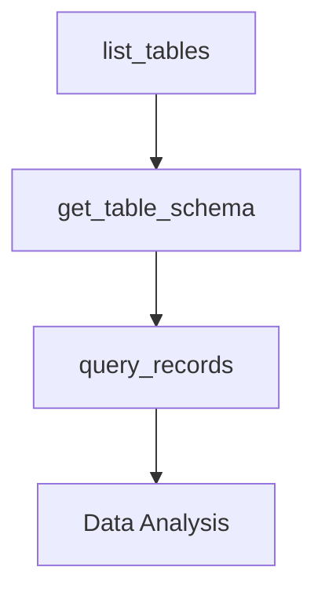
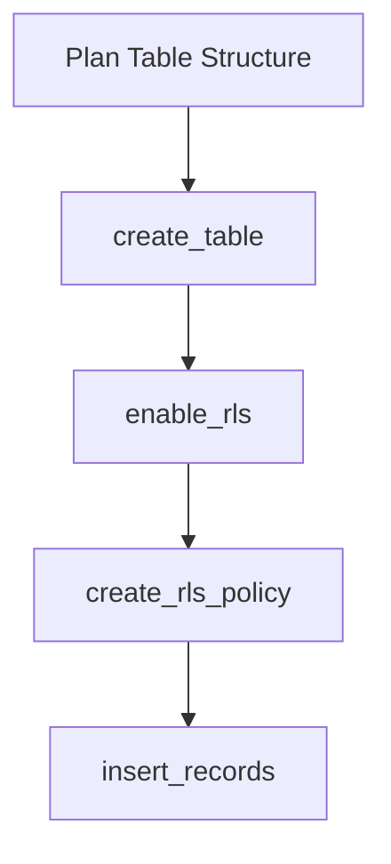
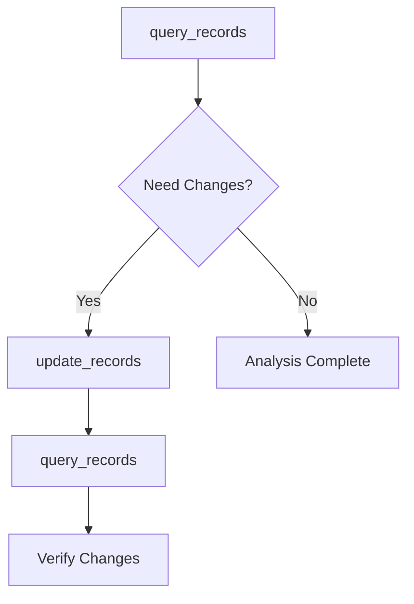

## Overview

Tablr MCP provides **16 comprehensive database management tools** that enable AI assistants to perform complex database operations through natural language. Each tool is designed with safety, security, and ease of use in mind.

<Note>
All tools include built-in validation, error handling, and security features like SQL injection protection and operation confirmations for destructive actions.
</Note>

## Tools by Category

### Database Discovery

Tools for exploring and understanding your database structure.

<CardGroup cols={2}>
  <Card title="list_tables" icon="table" href="/mcp/tools/list-tables">
    Discover all tables in your database with automatic schema detection
  </Card>
  <Card title="get_table_schema" icon="sitemap" href="/mcp/tools/get-table-schema">
    Get detailed column information, types, constraints, and relationships
  </Card>
</CardGroup>

### Table Structure Management

Tools for creating, modifying, and removing database tables.

<CardGroup cols={3}>
  <Card title="create_table" icon="plus" href="/mcp/tools/create-table">
    Build new tables with columns, constraints, and relationships
  </Card>
  <Card title="alter_table" icon="wrench" href="/mcp/tools/alter-table">
    Modify existing table structures safely
  </Card>
  <Card title="drop_table" icon="trash" href="/mcp/tools/drop-table">
    Remove tables with confirmation and cascade options
  </Card>
</CardGroup>

### Data Operations

Tools for querying, inserting, updating, and deleting database records.

<CardGroup cols={2}>
  <Card title="query_records" icon="magnifying-glass" href="/mcp/tools/query-records">
    Advanced filtering, sorting, and pagination for data retrieval
  </Card>
  <Card title="insert_records" icon="arrow-up" href="/mcp/tools/insert-records">
    Add single or multiple records with validation and conflict handling
  </Card>
  <Card title="update_records" icon="pen-to-square" href="/mcp/tools/update-records">
    Modify existing data with flexible field mapping and safety checks
  </Card>
  <Card title="delete_records" icon="minus" href="/mcp/tools/delete-records">
    Remove records with confirmation and limit safeguards
  </Card>
</CardGroup>

### Advanced Operations

Tools for custom SQL execution and specialized database operations.

<CardGroup cols={2}>
  <Card title="execute_sql" icon="code" href="/mcp/tools/execute-sql">
    Run custom SQL queries with safety checks and parameter binding
  </Card>
  <Card title="call_function" icon="function" href="/mcp/tools/call-function">
    Execute Supabase database functions with parameter handling
  </Card>
  <Card title="list_functions" icon="list" href="/mcp/tools/list-functions">
    Discover available database functions and their signatures
  </Card>
</CardGroup>

### Security & Access Control

Tools for managing Row Level Security (RLS) policies and database access.

<CardGroup cols={2}>
  <Card title="list_rls_policies" icon="shield-check" href="/mcp/tools/list-rls-policies">
    View all RLS policies for tables and their configurations
  </Card>
  <Card title="create_rls_policy" icon="shield-plus" href="/mcp/tools/create-rls-policy">
    Create new Row Level Security policies with custom rules
  </Card>
  <Card title="enable_rls" icon="lock" href="/mcp/tools/enable-rls">
    Enable Row Level Security for specific tables
  </Card>
  <Card title="disable_rls" icon="unlock" href="/mcp/tools/disable-rls">
    Disable Row Level Security with confirmation prompts
  </Card>
</CardGroup>

## Tools Matrix

| Tool | Category | Risk Level | Confirmation Required | Primary Use Case |
|------|----------|------------|----------------------|------------------|
| `list_tables` | Discovery | Safe | No | Explore database structure |
| `get_table_schema` | Discovery | Safe | No | Understand table definitions |
| `query_records` | Data | Safe | No | Retrieve and analyze data |
| `insert_records` | Data | Low | No | Add new data entries |
| `update_records` | Data | Medium | No | Modify existing data |
| `delete_records` | Data | High | Yes | Remove data records |
| `create_table` | Structure | Medium | No | Build new tables |
| `alter_table` | Structure | Medium | No | Modify table structure |
| `drop_table` | Structure | High | Yes | Remove entire tables |
| `execute_sql` | Advanced | Variable | No* | Custom database operations |
| `call_function` | Advanced | Variable | No | Execute stored procedures |
| `list_functions` | Advanced | Safe | No | Discover available functions |
| `list_rls_policies` | Security | Safe | No | Review security policies |
| `create_rls_policy` | Security | Medium | No | Implement access control |
| `enable_rls` | Security | Medium | No | Activate table security |
| `disable_rls` | Security | High | Yes | Remove table security |

<sup>*</sup> `execute_sql` blocks dangerous operations automatically

## Common Usage Patterns

### Database Exploration Workflow


### Table Creation Workflow  


### Data Management Workflow


## Safety Features

### Built-in Protections

<CardGroup cols={2}>
  <Card title="SQL Injection Prevention" icon="shield-virus">
    All tools use parameterized queries to prevent injection attacks
  </Card>
  <Card title="Operation Confirmation" icon="circle-check">
    Destructive operations require explicit confirmation parameters
  </Card>
  <Card title="Input Validation" icon="check-double">
    Comprehensive validation of all parameters before execution
  </Card>
  <Card title="Error Handling" icon="triangle-exclamation">
    Detailed error messages with suggestions for resolution
  </Card>
</CardGroup>

### Destructive Operation Safeguards

Tools that can permanently delete or modify data include additional safety measures:

- **`delete_records`**: Requires `confirm: true` parameter
- **`drop_table`**: Requires `confirm: true` parameter  
- **`disable_rls`**: Requires `confirm: true` parameter
- **`execute_sql`**: Automatically blocks dangerous operations like `DROP DATABASE`

## Performance Considerations

### Tool Execution Times

| Tool Category | Typical Response Time | Factors Affecting Performance |
|---------------|----------------------|------------------------------|
| Discovery | < 100ms | Number of tables/columns |
| Data Query | 100ms - 2s | Result set size, filters, indexes |
| Data Modification | 50ms - 500ms | Number of records, constraints |
| Structure Changes | 200ms - 1s | Table size, foreign keys |
| SQL Execution | Variable | Query complexity, data size |

### Optimization Tips

<Tip>
For large datasets, use `limit` and `offset` parameters with `query_records` to implement pagination and improve response times.
</Tip>

## Error Handling

### Common Error Categories

1. **Connection Errors**: Supabase connectivity issues
2. **Authentication Errors**: Invalid service role keys
3. **Permission Errors**: Insufficient database privileges  
4. **Validation Errors**: Invalid parameters or data types
5. **Constraint Errors**: Foreign key or unique constraint violations

### Error Response Format

All tools return consistent error responses:

```json
{
  "success": false,
  "error": {
    "type": "ValidationError",
    "message": "Table 'users' not found",
    "suggestions": [
      "Check table name spelling",
      "Use list_tables to see available tables"
    ]
  }
}
```

## Getting Started

<CardGroup cols={2}>
  <Card
    title="Installation Guide"
    icon="download"
    href="/mcp/installation"
  >
    Set up Tablr MCP on your system
  </Card>
  <Card
    title="Configuration"
    icon="gear"
    href="/mcp/configuration"
  >
    Configure your Supabase connection
  </Card>
  <Card
    title="Integration Guide"
    icon="plug"
    href="/mcp/integration"
  >
    Connect with Claude Desktop or other MCP clients
  </Card>
  <Card
    title="Examples & Tutorials"
    icon="graduation-cap"
    href="/mcp/examples"
  >
    Learn through practical examples
  </Card>
</CardGroup>

## Next Steps

1. **Start with Discovery**: Use `list_tables` and `get_table_schema` to explore your database
2. **Try Safe Operations**: Practice with `query_records` to understand the tool responses
3. **Gradually Expand**: Move to data modification and structure management tools
4. **Implement Security**: Set up RLS policies for production use

<Note>
Each tool has detailed documentation with parameters, examples, and best practices. Click on any tool card above to dive deeper into its specific functionality.
</Note>