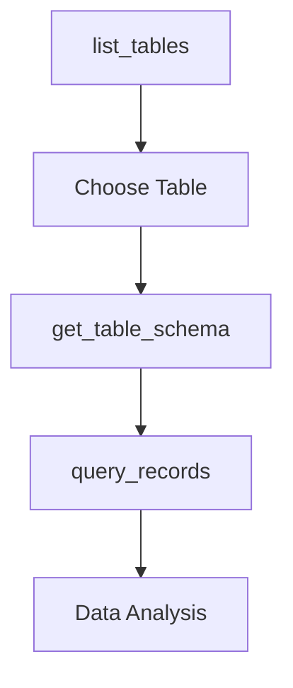

## Overview

The `list_tables` tool provides automatic discovery of all tables in your Supabase database. This is typically the first tool you'll use when exploring a database, as it gives you a complete overview of the available data structures.

<Note>
This is a **safe operation** that only reads metadata and never modifies your database.
</Note>

## Parameters

The `list_tables` tool requires no parameters - it automatically discovers all accessible tables.

```json
{}
```

## Response Format

The tool returns a comprehensive list of all tables with their schema information:

```json
{
  "success": true,
  "data": [
    {
      "table_name": "users",
      "schema": "public"
    },
    {
      "table_name": "posts", 
      "schema": "public"
    },
    {
      "table_name": "comments",
      "schema": "public"
    }
  ],
  "message": "Found 3 tables",
  "execution_time": "45ms"
}
```

## Usage Examples

<CodeGroup>

```json Basic Usage
{}
```

```bash Claude Desktop
"Show me all tables in my database"
```

```bash MCP Inspector
1. Select "list_tables" from the available tools
2. Click "Execute" (no parameters needed)
3. View the complete table listing
```

</CodeGroup>

## Response Fields

| Field | Type | Description |
|-------|------|-------------|
| `table_name` | string | The name of the table |
| `schema` | string | The schema containing the table (usually "public") |

## Common Use Cases

### Database Exploration
Use this as your starting point when working with an unfamiliar database:

```json
Request: {}
Response: {
  "success": true,
  "data": [
    {"table_name": "users", "schema": "public"},
    {"table_name": "orders", "schema": "public"},
    {"table_name": "products", "schema": "public"}
  ],
  "message": "Found 3 tables"
}
```

### Before Creating Tables
Check existing tables to avoid naming conflicts:

```json
Request: {}
Response: {
  "success": true,
  "data": [
    {"table_name": "customers", "schema": "public"}
  ],
  "message": "Found 1 table"
}
```

### Development Documentation
Generate documentation about your database structure automatically.

## Integration with Other Tools

The `list_tables` tool works seamlessly with other discovery tools:

<CardGroup cols={2}>
  <Card title="get_table_schema" icon="sitemap">
    Use the table names from `list_tables` to get detailed schema information
  </Card>
  <Card title="query_records" icon="magnifying-glass">
    Query data from any table discovered through `list_tables`
  </Card>
</CardGroup>

## Workflow Example



## Error Handling

### Connection Issues
```json
{
  "success": false,
  "error": {
    "type": "ConnectionError",
    "message": "Unable to connect to Supabase",
    "suggestions": [
      "Check your SUPABASE_URL environment variable",
      "Verify your internet connection",
      "Ensure Supabase project is active"
    ]
  }
}
```

### Authentication Problems
```json
{
  "success": false,
  "error": {
    "type": "AuthenticationError", 
    "message": "Invalid service role key",
    "suggestions": [
      "Verify SUPABASE_SERVICE_ROLE_KEY is correct",
      "Check key hasn't expired",
      "Ensure you're using service_role (not anon) key"
    ]
  }
}
```

### Permission Issues
```json
{
  "success": false,
  "error": {
    "type": "PermissionError",
    "message": "Insufficient permissions to list tables",
    "suggestions": [
      "Verify service role key has proper permissions",
      "Check database access policies",
      "Contact database administrator"
    ]
  }
}
```

## Performance Considerations

- **Response Time**: Typically < 100ms for most databases
- **Scaling**: Performance scales linearly with number of tables
- **Caching**: Results can be cached safely for short periods

<Tip>
This tool is very fast and can be called frequently without performance concerns. It's safe to use for real-time database exploration.
</Tip>

## Security Notes

- Only returns tables that your service role key has access to
- Respects Supabase Row Level Security (RLS) policies
- Never exposes sensitive table data, only metadata
- Safe to use in any environment

## Best Practices

### 1. Use as Starting Point
Always begin database exploration with `list_tables`:

```bash
# Good workflow
1. list_tables          # Get overview
2. get_table_schema     # Understand structure  
3. query_records        # Explore data
```

### 2. Error Handling
Always handle potential connection errors:

```javascript
const tables = await listTables();
if (!tables.success) {
  console.error("Failed to list tables:", tables.error.message);
  return;
}
```

### 3. Documentation
Use results to auto-generate database documentation:

```javascript
const tables = await listTables();
const tableList = tables.data.map(t => t.table_name).join(", ");
console.log(`Database contains: ${tableList}`);
```

## Troubleshooting

### No Tables Found
If the tool returns an empty list:

1. **Check Database**: Ensure your database has tables created
2. **Verify Schema**: Tables might be in non-public schemas
3. **Permissions**: Ensure service role has table access
4. **Connection**: Verify Supabase connection is working

### Incomplete Results  
If you expect more tables:

1. **Schema Access**: Some tables might be in other schemas
2. **RLS Policies**: Row Level Security might limit visibility
3. **Permissions**: Service role might not have access to all tables

## Related Tools

<CardGroup cols={3}>
  <Card title="get_table_schema" icon="sitemap" href="/mcp/tools/get-table-schema">
    Get detailed information about specific tables
  </Card>
  <Card title="create_table" icon="plus" href="/mcp/tools/create-table">
    Create new tables in your database
  </Card>
  <Card title="query_records" icon="magnifying-glass" href="/mcp/tools/query-records">
    Query data from discovered tables
  </Card>
</CardGroup>