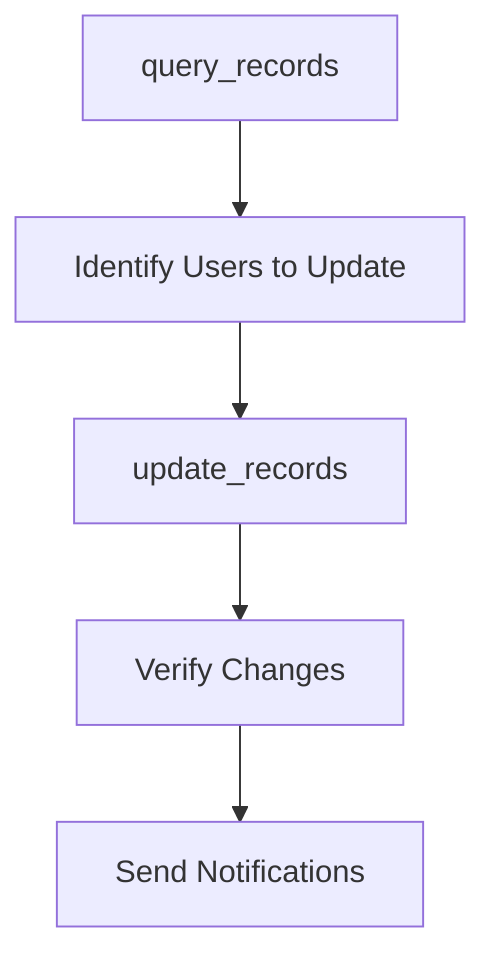
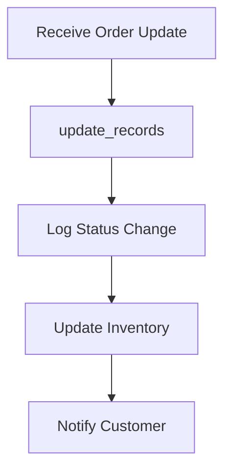
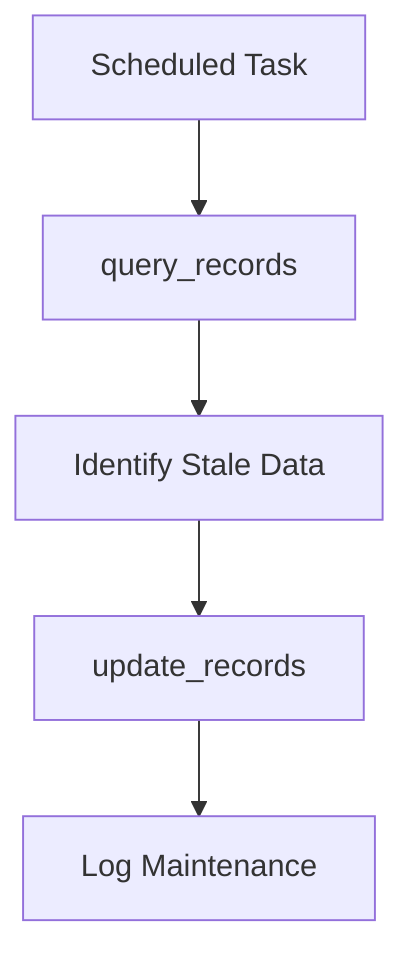

## Overview

The `update_records` tool enables you to modify existing data in your database tables. It supports flexible field updates, complex filtering conditions, and comprehensive safety checks to prevent unintended data modifications. The tool provides detailed feedback on update operations and supports batch updates.

<Warning>
This tool **modifies existing data** in your database. Always use appropriate filters to target specific records and avoid unintended updates.
</Warning>

## Parameters

| Parameter | Type | Required | Description |
|-----------|------|----------|-------------|
| `table_name` | string | Yes | Target table for updates |
| `filters` | object | Yes | Conditions to match records for update |
| `updates` | object | Yes | Field values to update |
| `return_records` | boolean | No | Whether to return updated records (default: true) |

### Filter Requirements

<Warning>
The `filters` parameter is **required** to prevent accidental updates to all records in a table. This safety mechanism ensures you explicitly target specific records.
</Warning>

## Request Format

```json
{
  "table_name": "users",
  "filters": {
    "id": {"eq": 123}
  },
  "updates": {
    "name": "Updated Name",
    "email": "newemail@example.com",
    "last_modified": "2023-12-01T10:30:00Z"
  },
  "return_records": true
}
```

## Response Format

```json
{
  "success": true,
  "data": {
    "updated_count": 1,
    "records": [
      {
        "id": 123,
        "name": "Updated Name",
        "email": "newemail@example.com",
        "last_modified": "2023-12-01T10:30:00Z",
        "created_at": "2023-11-15T09:00:00Z"
      }
    ],
    "filters_applied": {
      "id": {"eq": 123}
    },
    "fields_updated": ["name", "email", "last_modified"]
  },
  "message": "Successfully updated 1 record in 'users'",
  "execution_time": "76ms"
}
```

## Usage Examples

<CodeGroup>

```json Single Record Update
{
  "table_name": "users",
  "filters": {
    "email": {"eq": "john@example.com"}
  },
  "updates": {
    "name": "John Smith",
    "phone": "+1-555-0123",
    "updated_at": "2023-12-01T10:30:00Z"
  }
}
```

```json Multiple Records Update
{
  "table_name": "products",
  "filters": {
    "category": {"eq": "electronics"},
    "price": {"lt": 100.00}
  },
  "updates": {
    "discount": 0.15,
    "sale_active": true,
    "updated_at": "2023-12-01T10:30:00Z"
  }
}
```

```json Status Update
{
  "table_name": "orders",
  "filters": {
    "status": {"eq": "pending"},
    "created_at": {"lt": "2023-11-01T00:00:00Z"}
  },
  "updates": {
    "status": "expired",
    "expired_at": "2023-12-01T10:30:00Z"
  }
}
```

```json Conditional Update
{
  "table_name": "user_accounts",
  "filters": {
    "last_login": {"lt": "2023-06-01T00:00:00Z"},
    "status": {"eq": "active"}
  },
  "updates": {
    "status": "inactive",
    "reason": "inactive_user",
    "deactivated_at": "2023-12-01T10:30:00Z"
  },
  "return_records": false
}
```

```bash Claude Desktop
"Update the user with email john@example.com to set their name to John Smith"
"Mark all pending orders older than 30 days as expired"
"Set discount to 20% for all products in the electronics category"
```

</CodeGroup>

## Filter Examples

### Single Field Filters
```json
{
  "filters": {
    "id": {"eq": 123},
    "status": {"eq": "active"},
    "email": {"eq": "user@example.com"}
  }
}
```

### Range Filters
```json
{
  "filters": {
    "price": {"gte": 50.00, "lte": 200.00},
    "created_at": {"gte": "2023-11-01", "lt": "2023-12-01"}
  }
}
```

### List Filters
```json
{
  "filters": {
    "category": {"in": ["electronics", "books", "clothing"]},
    "status": {"not_in": ["deleted", "banned"]}
  }
}
```

### Null Filters
```json
{
  "filters": {
    "deleted_at": {"is_null": true},
    "email_verified": {"not_null": true}
  }
}
```

### Text Search Filters
```json
{
  "filters": {
    "name": {"ilike": "%john%"},
    "email": {"like": "%@company.com"}
  }
}
```

## Update Field Types

### Simple Value Updates
```json
{
  "updates": {
    "name": "New Name",
    "age": 25,
    "active": true,
    "price": 99.99
  }
}
```

### Null Updates
```json
{
  "updates": {
    "phone": null,
    "notes": null,
    "deleted_at": "2023-12-01T10:30:00Z"
  }
}
```

### JSON Field Updates
```json
{
  "updates": {
    "metadata": {
      "preferences": {
        "theme": "dark",
        "notifications": true
      },
      "tags": ["premium", "verified"]
    }
  }
}
```

### Timestamp Updates
```json
{
  "updates": {
    "updated_at": "2023-12-01T10:30:00Z",
    "last_login": "2023-12-01T10:29:45Z",
    "expires_at": "2024-12-01T00:00:00Z"
  }
}
```

## Common Update Patterns

### User Profile Updates
```json
{
  "table_name": "user_profiles",
  "filters": {
    "user_id": {"eq": 123}
  },
  "updates": {
    "first_name": "John",
    "last_name": "Doe",
    "bio": "Software developer and tech enthusiast",
    "profile_picture_url": "https://example.com/avatar.jpg",
    "updated_at": "2023-12-01T10:30:00Z"
  }
}
```

### Order Status Management
```json
{
  "table_name": "orders",
  "filters": {
    "id": {"eq": 12345}
  },
  "updates": {
    "status": "shipped",
    "tracking_number": "TRK123456789",
    "shipped_at": "2023-12-01T10:30:00Z",
    "carrier": "FedEx"
  }
}
```

### Inventory Management
```json
{
  "table_name": "products",
  "filters": {
    "sku": {"eq": "WIDGET-001"}
  },
  "updates": {
    "stock_quantity": 150,
    "last_restocked": "2023-12-01T10:30:00Z",
    "reorder_level": 25
  }
}
```

### Bulk Status Updates
```json
{
  "table_name": "subscriptions",
  "filters": {
    "expires_at": {"lt": "2023-12-01T00:00:00Z"},
    "status": {"eq": "active"}
  },
  "updates": {
    "status": "expired",
    "expired_at": "2023-12-01T10:30:00Z"
  }
}
```

## Error Handling

### No Records Match Filter
```json
{
  "success": true,
  "data": {
    "updated_count": 0,
    "records": [],
    "message": "No records matched the specified filters"
  },
  "message": "No records were updated",
  "execution_time": "34ms"
}
```

### Invalid Column Name
```json
{
  "success": false,
  "error": {
    "type": "ValidationError",
    "message": "Column 'invalid_field' does not exist in table 'users'",
    "suggestions": [
      "Use get_table_schema to see available columns",
      "Check column name spelling",
      "Verify column exists in table"
    ]
  }
}
```

### Data Type Mismatch
```json
{
  "success": false,
  "error": {
    "type": "ValidationError",
    "message": "Invalid data type for column 'age': expected integer, got string",
    "field": "age",
    "value": "twenty-five",
    "suggestions": [
      "Provide correct data type for column",
      "Check get_table_schema for column types",
      "Validate data before update"
    ]
  }
}
```

### Constraint Violation
```json
{
  "success": false,
  "error": {
    "type": "ConstraintError",
    "message": "Unique constraint violation: email 'existing@example.com' already exists",
    "suggestions": [
      "Check for existing records with same value",
      "Use different value for unique fields",
      "Handle conflicts in application logic"
    ]
  }
}
```

### Missing Filters
```json
{
  "success": false,
  "error": {
    "type": "SafetyError",
    "message": "Filters are required for update operations",
    "suggestions": [
      "Provide filters to target specific records",
      "This prevents accidental updates to all records",
      "Use appropriate filter conditions"
    ]
  }
}
```

## Safety Features

### Mandatory Filters
All update operations require filters to prevent accidental bulk updates:

```json
// This will FAIL - no filters provided
{
  "table_name": "users",
  "updates": {"status": "inactive"}
}

// This will SUCCEED - specific filter provided
{
  "table_name": "users", 
  "filters": {"id": {"eq": 123}},
  "updates": {"status": "inactive"}
}
```

### Update Confirmation
The tool provides detailed information about what was updated:

```json
{
  "data": {
    "updated_count": 5,
    "filters_applied": {"category": {"eq": "electronics"}},
    "fields_updated": ["price", "discount", "updated_at"]
  }
}
```

## Integration with Other Tools

<CardGroup cols={2}>
  <Card title="query_records" icon="magnifying-glass">
    Find records to update and verify changes
  </Card>
  <Card title="get_table_schema" icon="sitemap">
    Check column types before updating
  </Card>
  <Card title="insert_records" icon="arrow-up">
    Add new records based on update insights
  </Card>
  <Card title="delete_records" icon="minus">
    Remove records that no longer need updates
  </Card>
</CardGroup>

## Best Practices

### 1. Always Use Specific Filters
Target updates precisely to avoid unintended changes:

```json
// Good: Specific filter
{
  "filters": {"id": {"eq": 123}},
  "updates": {"name": "New Name"}
}

// Risky: Broad filter
{
  "filters": {"status": {"eq": "active"}},  // May affect many records
  "updates": {"name": "New Name"}
}
```

### 2. Verify Before Updating
Check what records will be affected:

```bash
# Good workflow
1. query_records         # Check which records match filters
2. Verify target records # Ensure correct records selected
3. update_records        # Apply updates
4. query_records         # Verify changes applied correctly
```

### 3. Include Timestamp Updates
Track when records were last modified:

```json
{
  "updates": {
    "field1": "new_value",
    "field2": "another_value",
    "updated_at": "2023-12-01T10:30:00Z"  // Track modification time
  }
}
```

### 4. Handle Constraints Properly
Be aware of unique constraints and foreign keys:

```json
{
  "filters": {"id": {"eq": 123}},
  "updates": {
    "email": "new@example.com",  // Check if email is unique
    "category_id": 5             // Ensure category exists
  }
}
```

### 5. Use Return Records Wisely
For bulk updates, consider disabling record return:

```json
{
  "filters": {"status": {"eq": "pending"}},
  "updates": {"status": "processed"},
  "return_records": false  // Improves performance for bulk updates
}
```

## Performance Considerations

### Batch Size and Filtering
- **Targeted Filters**: Use indexed columns in filters for better performance
- **Record Count**: Updates affecting many records take longer
- **Return Records**: Disable for bulk operations to improve performance

### Index Usage
```json
// Good: Filter on indexed column
{
  "filters": {"id": {"eq": 123}},  // Primary key (indexed)
  "updates": {"name": "New Name"}
}

// Less efficient: Filter on non-indexed column
{
  "filters": {"description": {"like": "%text%"}},  // Text search
  "updates": {"status": "updated"}
}
```

## Common Workflows

### User Account Management


### Order Processing


### Data Maintenance


## Troubleshooting

### No Records Updated
If `updated_count` is 0:

1. **Check Filters**: Verify filter conditions match existing data
2. **Data Exists**: Use `query_records` to confirm records exist
3. **Filter Syntax**: Ensure filter operators are correct
4. **Case Sensitivity**: Use `ilike` instead of `like` for case-insensitive matching

### Update Failures
Common causes and solutions:

1. **Constraint Violations**: Check unique constraints and foreign keys
2. **Data Types**: Ensure update values match column types
3. **Permissions**: Verify service role can update the table
4. **Null Constraints**: Don't set required fields to null

### Performance Issues
If updates are slow:

1. **Add Indexes**: Ensure filter columns are indexed
2. **Reduce Scope**: Use more specific filters
3. **Batch Updates**: Break large updates into smaller batches
4. **Disable Returns**: Set `return_records: false` for bulk operations

## Related Tools

<CardGroup cols={3}>
  <Card title="query_records" icon="magnifying-glass" href="/mcp/tools/query-records">
    Find and verify records before and after updates
  </Card>
  <Card title="insert_records" icon="arrow-up" href="/mcp/tools/insert-records">
    Add new records when updates aren't sufficient
  </Card>
  <Card title="delete_records" icon="minus" href="/mcp/tools/delete-records">
    Remove records that should no longer exist
  </Card>
</CardGroup>