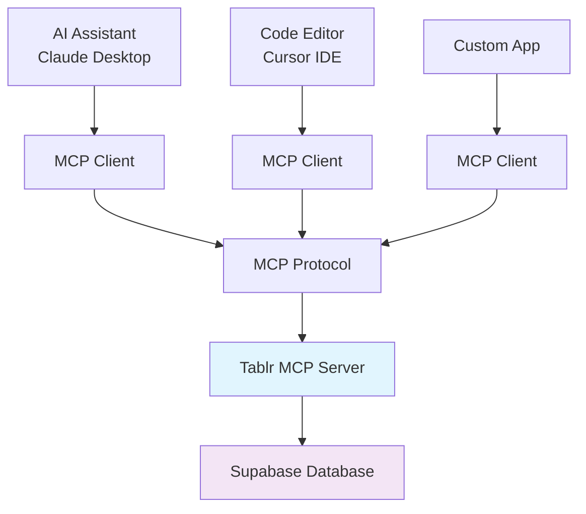

## Understanding Model Context Protocol

**Model Context Protocol (MCP)** is an open standard that enables AI assistants and applications to securely connect to external data sources and tools. Think of it as a bridge between AI models and your databases, APIs, or other services.

<Note>
MCP provides a standardized way for AI assistants to interact with external systems, making it possible to extend AI capabilities beyond their training data.
</Note>

## Key MCP Concepts

### MCP Server
A service that provides tools and data to AI clients. **Tablr MCP is an MCP server** that exposes database management capabilities to AI assistants.

### MCP Client
An application that uses MCP servers to extend its capabilities. Examples include:
- **Claude Desktop** - Anthropic's desktop application
- **Cursor IDE** - AI-powered code editor
- **Custom Applications** - Your own apps using the MCP SDK

### Tools
Functions that the server exposes for the client to use. Tablr MCP provides 16 database management tools like `list_tables`, `query_records`, and `create_table`.

### Transport
How the client and server communicate. MCP supports multiple transport methods:
- **stdio** - Standard input/output (most common)
- **HTTP** - Web-based communication
- **WebSocket** - Real-time bidirectional communication

## Why Use MCP?

<CardGroup cols={2}>
  <Card title="Standardized Interface" icon="handshake">
    Works with any MCP-compatible AI assistant - write once, use everywhere
  </Card>
  <Card title="Secure Access" icon="lock">
    Controlled access to your data with proper authentication and validation
  </Card>
  <Card title="Extensible" icon="puzzle-piece">
    Easy to add new capabilities as your needs grow
  </Card>
  <Card title="Interoperable" icon="arrows-spin">
    One server can work with multiple AI clients simultaneously
  </Card>
</CardGroup>

## MCP Architecture



## How MCP Works

### 1. **Connection Establishment**
The AI client connects to the MCP server using one of the supported transport methods (stdio, HTTP, or WebSocket).

### 2. **Capability Discovery**
The client asks the server what tools and resources are available. Tablr MCP responds with its 16 database management tools.

### 3. **Tool Execution**
When you ask the AI to perform a database operation, the client calls the appropriate tool on the server with the necessary parameters.

### 4. **Response Handling**
The server processes the request, interacts with your Supabase database, and returns formatted results to the client.

## MCP Benefits for Database Management

### Before MCP
```
You: "Show me users created this week"
Developer: 
1. Opens Supabase dashboard
2. Navigates to SQL editor
3. Writes SQL query manually
4. Executes and reviews results
5. Formats data for analysis
```

### With Tablr MCP
```
You: "Show me users created this week"
AI Assistant: [Automatically uses query_records tool with date filters]
Result: Formatted table of users with creation dates
```

## MCP vs Traditional Approaches

<CardGroup cols={2}>
  <Card title="Traditional Database Access" icon="terminal">
    - Manual SQL writing
    - Multiple tools and interfaces
    - Context switching between applications
    - Error-prone manual processes
  </Card>
  <Card title="MCP-Enabled Access" icon="magic-wand">
    - Natural language queries
    - Single interface through AI
    - Automated safety checks
    - Consistent, reliable operations
  </Card>
</CardGroup>

## Security Model

MCP implements several security layers:

### Authentication
- **Service Authentication**: Secure connection to external services (Supabase service keys)
- **Tool Authorization**: Control which tools are available to which clients

### Validation
- **Input Validation**: All parameters are validated before execution
- **SQL Injection Protection**: Parameterized queries prevent injection attacks
- **Operation Confirmation**: Destructive operations require explicit confirmation

### Access Control
- **Granular Permissions**: Tools can implement fine-grained access control
- **Audit Trails**: All operations can be logged for security monitoring
- **Rate Limiting**: Prevent abuse through operation throttling

## Real-World Use Cases

### Database Administration
```
"Create a backup of the users table"
"Show me the slowest queries from last week"
"Add an index on the email column"
```

### Data Analysis
```
"Find patterns in user engagement data"
"Compare sales metrics between regions"
"Identify outliers in transaction amounts"
```

### Development Support
```
"Set up the database schema for a new feature"
"Create test data for the orders table"
"Check database performance after deployment"
```

## MCP Ecosystem

### Popular MCP Clients
- **Claude Desktop** - Desktop AI assistant
- **Cursor** - AI code editor
- **Continue** - VS Code AI extension
- **Custom Applications** - Using MCP SDK

### Common MCP Server Types
- **Database Connectors** (like Tablr MCP)
- **API Integrators** (REST, GraphQL)
- **File System Tools**
- **Cloud Service Connectors**
- **Development Tools**

## Getting Started with MCP

<Tip>
Ready to experience MCP in action? Tablr MCP is designed to be your first step into the MCP ecosystem, providing a complete database management solution that works with any MCP-compatible AI assistant.
</Tip>

### Next Steps
1. **Check Prerequisites** - Ensure you have the required software and accounts
2. **Install Tablr MCP** - Set up the server on your system
3. **Configure Your AI Client** - Connect Claude Desktop or another MCP client
4. **Start Managing Databases** - Begin using natural language for database operations

## Learn More

<CardGroup cols={2}>
  <Card
    title="Prerequisites"
    icon="list-check"
    href="/mcp/prerequisites"
  >
    What you need to get started
  </Card>
  <Card
    title="Installation Guide"
    icon="download"
    href="/mcp/installation"
  >
    Step-by-step setup instructions
  </Card>
  <Card
    title="Available Tools"
    icon="toolbox"
    href="/mcp/tools"
  >
    Explore all database management tools
  </Card>
  <Card
    title="Integration Guide"
    icon="plug"
    href="/mcp/integration"
  >
    Connect with your AI assistant
  </Card>
</CardGroup>